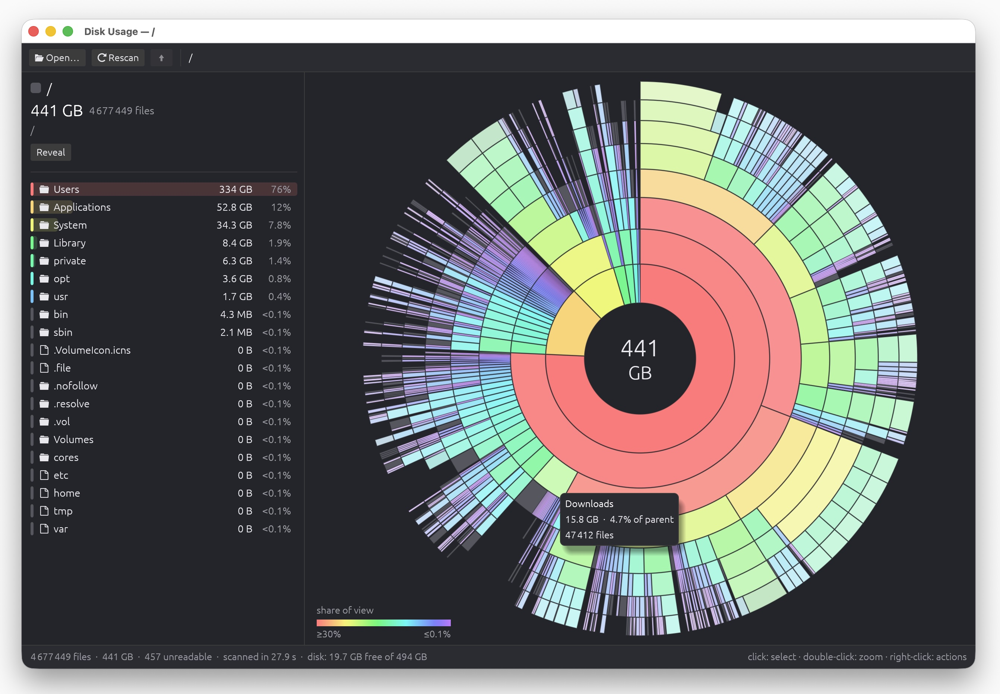

# Disk Usage

A small, fast, cross-platform app that shows where your disk space goes, as an
interactive sunburst chart in the spirit of DaisyDisk. It runs on Windows, macOS and Linux
as a single ~5 MB executable with no runtime dependencies.



- Rings are folder levels and each sector's angle is its size. Items too small to draw are
  merged into a grey "smaller objects" sector.
- Colors follow the rainbow by size, measured as a share of what is shown in the center:
  red for the biggest items (30% or more), then orange, yellow, green, cyan and blue, down to
  violet for the smallest (0.1% or less). The scale is logarithmic and a legend sits in the
  corner. Deeper rings are paler, and files are slightly more muted than folders.
- **Click** a sector to select it. The panel on the left then shows what's inside, largest
  first. Drag the panel's edge to resize it.
- **Double-click** a sector (or press <kbd>Enter</kbd>) to zoom into it. Click the center,
  press <kbd>Backspace</kbd> or use the breadcrumbs to go back up.
- **Right-click** for actions: show in Finder/Explorer, open, copy path, move to Trash.
- To scan a folder, drop it on the window, use **Open…** (<kbd>Ctrl/⌘+O</kbd>) or pass its
  path as an argument: `disk-usage ~/Downloads`.

## How sizes are counted

- On macOS and Linux, sizes are the actual space used on disk (allocated blocks), so they
  match `du`, not the apparent file size. On Windows, the file size is used.
- Symlinks are never followed, and hard-linked files are counted once.
- The scan stays on the file system of the folder you picked, like `du -x`. On macOS, both
  the system and data volumes are included when scanning `/`.
- The scan runs on many threads; on an SSD it is usually several times faster than `du`.
- macOS protects some folders (Desktop, Downloads, other apps' data, …) and asks for permission
  the first time they are read; the scan waits for the answer. To scan everything without
  prompts, add the app in System Settings → Privacy & Security → Full Disk Access.

## Building

```sh
build_scripts/build.sh               # release build into dist/ (on macOS: dist/Disk Usage.app)
build_scripts/build.sh --universal   # macOS: Apple Silicon + Intel in one app
build_scripts/build.sh --run         # build and launch

cargo run --release -- /path/to/scan               # or run directly
```

Linux needs the usual X11/Wayland development packages:

```sh
sudo apt-get install libxkbcommon-dev libgl1-mesa-dev libegl1-mesa-dev libwayland-dev \
  libx11-dev libxcursor-dev libxrandr-dev libxi-dev
```

GitHub Actions ([`.github/workflows/build.yml`](.github/workflows/build.yml)) builds and
tests every push for these platforms:

| Platform | Artifact |
|---|---|
| Linux x86_64 | `disk-usage-linux-x86_64.tar.gz` |
| Windows x86_64 | `disk-usage-windows-x86_64.zip` (the `.exe` has the app icon embedded) |
| macOS (universal: Apple Silicon + Intel) | `disk-usage-macos-universal.zip` with `Disk Usage.app` |

Pushing a `v*` tag publishes these as a GitHub release.

The macOS app is ad-hoc signed but not notarized. The first time, open it with
right-click → Open.

## Development

```sh
cargo test                                   # unit tests
cargo clippy --all-targets -- -D warnings
SCAN_BENCH=~/Documents cargo test --release bench_scan -- --ignored --nocapture
cargo test write_icon_assets -- --ignored    # regenerate assets/icon.{png,ico}
DISK_USAGE_SHOT=shot.png cargo run -- ~/src  # debug builds: save a screenshot and exit
```

| Module | Purpose |
|---|---|
| `scan.rs` | parallel scanner (rayon), progress, cancellation |
| `tree.rs` | compact arena tree, children sorted by size |
| `sunburst.rs` | chart layout, painting, hit-testing |
| `app.rs` | UI: toolbar, chart, details list, actions |
| `platform.rs` | reveal in file manager, open, drives |
| `colors.rs`, `icon.rs`, `format.rs` | palette, procedural app icon, number formatting |
